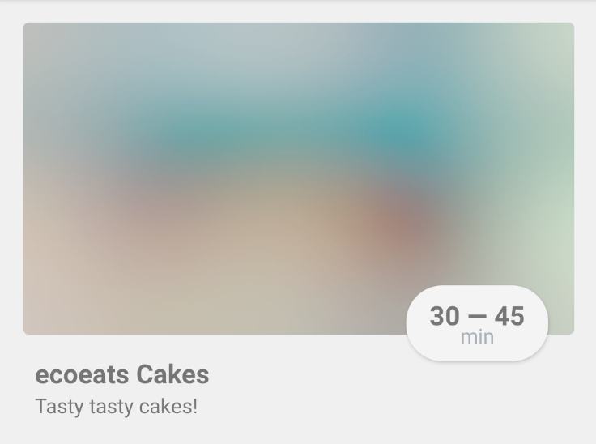

# React Native Blurhash

This is actually just a simple function that exports a blurhash string to a base64 encoded data URI. I'm using it for React Native, but you could use for any image display that supports a base64 URI.


### Usage in React Native

```tsx
<Image 
  source={{
    uri: blurhashToDataURI('LEHV6nWB2yk8pyo0adR*.7kCMdnj')
  }}
/>
```



